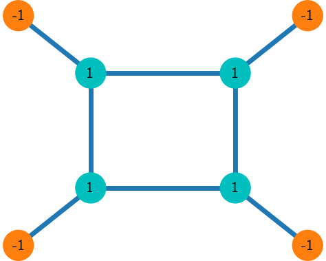

# UCL Summer School: Quantum Annealing

# Introduction
Quantum Annealers can be used to solve a host of optimization problems when framed within the context of the Ising model: 

<p align="center">
  
 </p>
 
Where h and J are the spin bias and couplings respectively. Using Python and the D-Wave 2000Q quantum annealer, this repository looks at error correction of ASCII messages sent over a noisy channel.

## Setup
To complete all tasks in this repo, copy and paste the following links into your browser, logging into to each of the services:
- Leap Account: ```https://cloud.dwavesys.com/leap/```
- D-Wave IDE with this repo: ```https://ide.dwavesys.io/#https://github.com/dtoconnor/UCL_DWave_Summer_School```

## Task 1: GUI
### Basic Operations
Go to ``two_spin_problem.py`` file and look at the basic two spin problem set out in the code. From here you will be able to use the D-Wave problem inspector to analyse each of the following four scenarios of the two spin system:
1. Two spins coupled by a ferromagnetic interaction (J = -1) with no local fields (preset in the code)
2. Two spins coupled by an anti-ferromagnetic interaction (J = 1) with no local fields
3. Two spins coupled by a ferromagnetic interaction (J = -1) with a small local field (say h = 0.2) on one of the spins
4. Two spins coupled by a ferromagnetic interaction (J = -1) with local fields of magnitude 1 pointing in opposite directions on the two spins. This is known as a **frustrated system** since it’s not possible for all three constraints (the ferromagnetic interaction and the two local fields) to be simultaneously satisfied. Such systems typically have many lowest energy solutions – what a physicist would call a multiply-degenerate ground state

It is recommended you do 1000 reads of the system when submitting the problem to get an idea of the solution frequency. From this you will identify why the D-Wave has returned the solutions that you now see for each of the four problems, and try to identify why some solutions are more preferable than others (especially scenario 4).

### Spin-Reversal Transforms
By introducing a new coefficient that is equal to +1 or -1 for every spin in the system, we get the new Hamiltonian,

<p align="center">
  
 </p>

Which is equal to the original Ising Hamiltonian with new bias and coupling values,

<p align="center">
  
 </p>
 
Therefore the D-Wave not only solves the requested problem but spin-reversal forms of it as well. This allows the D-Wave machine can minimize some of the in-built asymmetries which you may have noticed earlier on.

Now try running some of the previous two-spin Hamiltonians (especially scenario 4), this time incorporating spin-reversal transforms. To do this change the `num_spin_reversal_transforms` flag in the `sample_ising` command. This should be at most 2^n – *i.e.* four! *Are the results now more evenly distributed across the degenerate ground-state spin configurations?*
 

## Task 2: Error correction
One real-world application from the telecommunications industry which we have looked at in UCL is how to use the D-Wave as a decoder for classical error-correcting codes. Such codes are universally used in communication systems to allow recovery of data from signals which are corrupted by noise when being transmitted from source to receiver.

In the Ising Code, bits of data to be transmitted are mapped onto the local fields of an Ising spin-glass. Additional bits (which are used for error correction) corresponding to the couplers of the Ising-spin glass are also transmitted. Some of the information bits and/or the error-checking bits might get corrupted by noise. But the original information bits can be recovered by finding the minimum-energy spin configuration of the Ising spin-glass corresponding to the received corrupted bits.

Too see how this works, consider a simple example with two information bits. We encode these two bits of information onto the local fields of a two-spin Ising system. (For example 0 is encoded by h = -1 and 1 is encoded by h = +1.) We now set the coupler between these two spins in such a way that the system is not frustrated (i.e. if the two bits are equal, make the coupler ferromagnetic; and if the two bits differ make the coupler anti-ferromagnetic). If the three transmitted bits (i.e. the two information bits and the error-check bits) are not corrupted in transmission, then the minimum energy spin configuration corresponds to the bits of information.

Let’s now suppose that one of the three bits is now corrupted in transmission. We might now have two aligned fields with an anti-ferromagnetic coupler (or indeed two anti-aligned fields with a ferromagnetic coupler). The system is now frustrated, which is indicative of an error in transmission. 

If there are two or more couplers attached to each spin then not only can the error be detected but also it can be corrected – i.e. the corrupted bit can be reset to its uncorrupted value. In fact the best (maximum likelihood) estimate of what the correct bit (or set of bits) is corresponds to the minimum energy spin configuration of the received corrupted set of bits.

Take a look at the python code ``error_correction.py`` within the D-Wave IDE. Using the top right play button in the IDE, you can run the code straight away to then retrieve a result from a D-Wave sampler. 

This code takes a sentence, maps it onto an Ising spin glass, and flips some random fraction of both the local fields and the couplers. This produces a sentence which is full of corrupted characters. The D-Wave machine then finds the minimum energy spin configuration of the corrupted set of fields and couplers. This corresponds to the error-corrected message which (hopefully!) has less garbage than without error-correction. 

Have a play with this code and make sure that you understand its key features. How does the error rate of the decoder vary with the fraction of bits which are corrupted in transmission (variable: “crossoverprob”)? 


## Task 3: Degenerate Hamiltonian 
Everything we have discussed so-far looks pretty classical: is the D-Wave machine really a quantum computer? To address this question at UCL we worked on a highly-degenerate 8-spin Hamiltonian which has 17 different minimum energy solutions. The Hamiltonian consists of a ring of four spins, with each spin coupled ferromagnetically to its two immediate neighbours in the ring. In addition, each of the four spins in the ring is coupled ferromagnetically to one additional “ancilla” spin (not in the ring). The local fields for all the spins in the ring point in one direction while the local fields for all the ancilla spins point in the opposite direction.

 

Using ``degenerate_Hamiltonian.py``, set all eight couplers to -1, the local fields on the four ring spins to +1 and the local fields on the four ancilla spins to -1. You should find 17 ground states, of which one seems not to occur very frequently. (You might need to run this a few times and keep a tally!) This so-called “isolated” state (in which all eight spins point in the same direction) can only be accessed from the other 16 states by classical thermal fluctuations. In other words the fact that the isolated state does not occur very often supports the conclusion that quantum mechanics is playing a role in the D-Wave machine. 

Now, as a control experiment, we want to increase the role of classical thermal fluctuations to see what happens to the isolated state. This you can do by changing the thermal control parameter *alpha* such that it scales all the values of the couplers and the local fields to ±0.1. This reduces the energy scale of the entire Hamiltonian. Since the D-Wave machine sits at a fixed temperature (around 20 mK), the net effect is to increase the effect of thermal fluctuations. What happens to the isolated state now?


